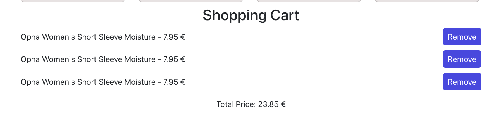

# React Shopping Website

This is a sample React-based e-commerce website that allows users to browse products, view product details, add products to the cart, and check out. It includes features like category filtering and a responsive design.

## Technologies Used

- React
- React Router for navigation
- Bootstrap for styling
- Bootstrap Icons for icons

## Features

- Browse a list of products.
- Filter products by category.
- View product details.
- Add and remove products from the shopping cart.
- Responsive design for mobile and desktop.

